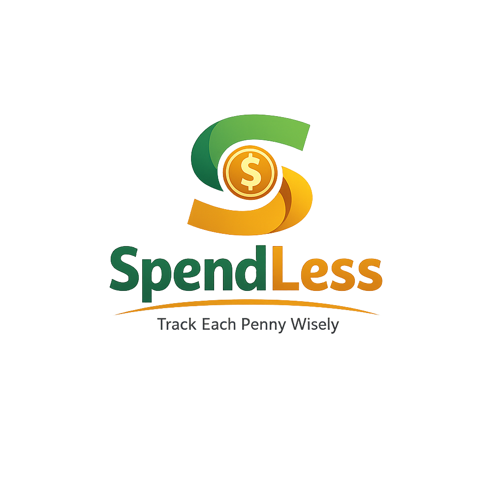

<p align="center">
  
</p>

# 💰 SpendLess

**Track Every Penny Wisely.**

SpendLess is a personal finance tracker that I built to help users keep track of their income, expenses, savings goals, and monthly budgets in a simple way.

The idea behind this project was to create something practical that people can actually use in day-to-day life instead of just building another CRUD application. It allows users to record expenses, visualize spending patterns, monitor savings goals, and stay aware of where their money is going.

### 🔗 Live Demo

https://spendless-managingspendings.netlify.app/

---

## Features

* Add, edit, and delete expenses
* Categorize expenses for better tracking
* Track monthly income and remaining balance
* Create and manage multiple savings goals
* View expense breakdown through charts
* Monitor spending trends over time
* Calendar view for daily expense tracking
* Category-wise budget monitoring
* Financial health indicator
* Export data as JSON
* Light and Dark mode
* Fully responsive design

---

## Tech Stack

* HTML5
* CSS3
* JavaScript (ES6)
* Chart.js
* FullCalendar.js
* LocalStorage API
* Remix Icons

---

## Project Structure

```text
SpendLess/
│
├── index.html
├── style.css
├── script.js
├── spendlessfevicon.png
└── README.md
```

---

## Why I Built This

While learning JavaScript, I wanted to build a project that involved real-world data handling, DOM manipulation, LocalStorage, charts, filtering, and responsive design.

Instead of creating a simple expense calculator, I decided to build a complete personal finance tracker with analytics, goals, budgets, and calendar-based tracking.

This project helped me improve my understanding of:

* JavaScript fundamentals
* LocalStorage
* Dynamic UI rendering
* Data visualization
* Responsive design
* User experience design

---

## Current Functionality

Users can:

1. Set monthly income
2. Add expenses with categories and dates
3. Track spending activity
4. Monitor savings goals
5. View analytics and insights
6. Check expenses on a calendar
7. Export data for backup

All data is stored locally in the browser.

---

## Future Improvements

Some features I would like to add in future versions:

* Custom budget creation
* Recurring expenses
* Monthly reports
* Data import functionality
* Backend integration
* Cloud synchronization

---

## Author

**Tanvi Pohankar**

* Portfolio: https://tanvi.dev
* LinkedIn: https://www.linkedin.com/in/tanvipohankar

---

If you like the project, feel free to star the repository.
